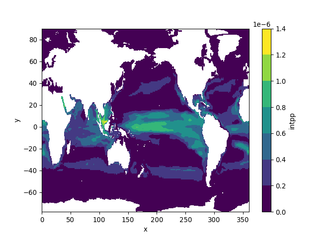

Accessing CMIP6 ESM data
================
Denisse Fierro Arcos
2022-10-12

-   <a href="#introduction" id="toc-introduction">Introduction</a>
    -   <a href="#loading-libraries" id="toc-loading-libraries">Loading
        libraries</a>
    -   <a href="#querying-esgf-server" id="toc-querying-esgf-server">Querying
        ESGF server</a>
        -   <a href="#reviewing-and-tidying-up-search-results"
            id="toc-reviewing-and-tidying-up-search-results">Reviewing and tidying
            up search results</a>
    -   <a href="#querying-esgf-server-searching-for-one-specific-variable"
        id="toc-querying-esgf-server-searching-for-one-specific-variable">Querying
        ESGF server: Searching for one specific variable</a>
    -   <a href="#accessing-and-downloading-subsets-of-cmip6-data"
        id="toc-accessing-and-downloading-subsets-of-cmip6-data">Accessing and
        downloading subsets of CMIP6 data</a>
        -   <a href="#switching-to-python" id="toc-switching-to-python">Switching to
            <code>Python</code></a>
        -   <a href="#loading-python-libraries"
            id="toc-loading-python-libraries">Loading <code>Python</code>
            libraries</a>
        -   <a href="#transforming-cmip6-search-results-into-a-python-variable"
            id="toc-transforming-cmip6-search-results-into-a-python-variable">Transforming
            CMIP6 search results into a <code>Python</code> variable</a>
        -   <a href="#accessing-and-saving-cmip6-data"
            id="toc-accessing-and-saving-cmip6-data">Accessing and saving CMIP6
            data</a>
        -   <a href="#checking-subsetted-data"
            id="toc-checking-subsetted-data">Checking subsetted data</a>
        -   <a href="#plotting-results" id="toc-plotting-results">Plotting
            results</a>

# Introduction

In this notebook we will access Coupled Model Intercomparison Project
Phase 6 (CMIP6) data from the Earth System Grid Federation
([ESGF](https://esgf.nci.org.au/search/cmip6-nci/)) platform.

We will be using some functions from the
[epwshiftr](https://github.com/ideas-lab-nus/epwshiftr) package, which
have been modified slightly to access ocean and sea ice outputs.

Once the correct datasets have been identified, a subset of the dataset
will be selected and downloaded to your local machine. Here we have
chosen to select the first and last decades for each dataset, that is
from 1850 to 1859 and from 2005 to 2014 for the historical runs, and
from 2015 to 2024 and from 2091 to 2100 for the shared socioeconomic
pathways (SSPs). Future scenario runs up to 2300 have been excluded
here.

## Loading libraries

The functions adapted from `epwshiftr`, which are on the accompanying
`search_download_functions` script will help us connect to the
Australian-based ESGF node hosted by the National Computational
Infrastructure ([NCI](http://nci.org.au/)). There are several ESGF nodes
available worldwide and they can be found
[here](https://aims2.llnl.gov/nodes). If you wish to change the node
used in the script use the `node_url` parameter of the `cmip6_index`
function to provide the link to the search page for the node. The link
should look like this: <https://esgf.nci.org.au/esg-search/search/?> and
it points to a `xml` file, which is similar to a table of contents for
the datasets available within the node.

All other libraries allow us to manipulate and save CMIP6 data.

``` r
search_CMIP6 <- source("search_download_functions.R")
library(tidyverse)
library(reticulate)
library(lubridate)
```

## Querying ESGF server

We will use the `cmip6_index` function included in the accompanying
`search_download_functions` script to search the Australian node of
ESGF. We save the results as a table in our environment.

There are thousands of CMIP6 endorsed model outputs available through
ESGF, so providing as many parameters as possible in the database search
is important to narrow down results. You could refer to the following
websites for more information:  
- [CMIP6
documentation](https://github.com/ES-DOC/esdoc-docs/tree/master/cmip6/experiments/spreadsheet) -
[CMIP6 controlled vocabulary](https://github.com/WCRP-CMIP/CMIP6_CVs) -
[World Climate Research Programme
(WCRP)](https://www.wcrp-climate.org/modelling-wgcm-mip-catalogue/modelling-wgcm-cmip6-endorsed-mips) -
[CMIP6 overview](https://pcmdi.llnl.gov/CMIP6/) - [CMIP6 Guidance for
Data Users](https://pcmdi.llnl.gov/CMIP6/Guide/dataUsers.html) - [CMIP6
Data Request](https://clipc-services.ceda.ac.uk/dreq/mipVars.html) -
[CMIP6 Global Attributes
Definitions](https://docs.google.com/document/d/1h0r8RZr_f3-8egBMMh7aqLwy3snpD6_MrDz1q8n5XUk/edit)

Note that parameters are compulsory, we can provide as many or as little
as needed.

``` r
results_query <- cmip6_index(
  # This parameter relates to the broad experiment group a dataset belongs to. In this example we consider:
  # CMIP (past conditions) and ScenarioMIP (future scenarios, SSPs) activities
  activity = c("ScenarioMIP", "CMIP"),
  
  # Standardised name for variables of interest - See CMIP6 Data Request for more information
  variable = c("tos", "siconc", "intpp"),
  
  # This ranges from hours to years - See CMIP6 Data Request for frequency available for each variable
  frequency = "mon",
  
  # Specifying experiment names - Descriptions are available in the CMIP6 documentation
  experiment = c("ssp126", "ssp245", "ssp585", "historical"),
  
  # Specifying model names - A list of all models can be found in the CMIP6 controlled vocabulary link
  source = c("ACCESS-ESM1-5"),
  
  # Specifying variant, which refers to the model run 
  variant = "r1i1p1f1",
  
  # Specifying time frame of interest
  years = NULL,
  
  # Save to data dictionary
  save = TRUE)

#We will only show the first three results of our search.
head(results_query, n = 3)
```

    ##                                                                                                                                                        file_id
    ## 1: CMIP6.CMIP.CSIRO.ACCESS-ESM1-5.historical.r1i1p1f1.Omon.intpp.gn.v20191115.intpp_Omon_ACCESS-ESM1-5_historical_r1i1p1f1_gn_185001-201412.nc|esgf.nci.org.au
    ## 2:     CMIP6.CMIP.CSIRO.ACCESS-ESM1-5.historical.r1i1p1f1.Omon.tos.gn.v20191115.tos_Omon_ACCESS-ESM1-5_historical_r1i1p1f1_gn_185001-201412.nc|esgf.nci.org.au
    ## 3:  CMIP6.ScenarioMIP.CSIRO.ACCESS-ESM1-5.ssp245.r1i1p1f1.Omon.intpp.gn.v20191115.intpp_Omon_ACCESS-ESM1-5_ssp245_r1i1p1f1_gn_201501-210012.nc|esgf.nci.org.au
    ##                                                                                       dataset_id
    ## 1:    CMIP6.CMIP.CSIRO.ACCESS-ESM1-5.historical.r1i1p1f1.Omon.intpp.gn.v20191115|esgf.nci.org.au
    ## 2:      CMIP6.CMIP.CSIRO.ACCESS-ESM1-5.historical.r1i1p1f1.Omon.tos.gn.v20191115|esgf.nci.org.au
    ## 3: CMIP6.ScenarioMIP.CSIRO.ACCESS-ESM1-5.ssp245.r1i1p1f1.Omon.intpp.gn.v20191115|esgf.nci.org.au
    ##    mip_era activity_drs institution_id     source_id experiment_id member_id
    ## 1:   CMIP6         CMIP          CSIRO ACCESS-ESM1-5    historical  r1i1p1f1
    ## 2:   CMIP6         CMIP          CSIRO ACCESS-ESM1-5    historical  r1i1p1f1
    ## 3:   CMIP6  ScenarioMIP          CSIRO ACCESS-ESM1-5        ssp245  r1i1p1f1
    ##    table_id frequency grid_label  version nominal_resolution variable_id
    ## 1:     Omon       mon         gn 20191115             250 km       intpp
    ## 2:     Omon       mon         gn 20191115             250 km         tos
    ## 3:     Omon       mon         gn 20191115             250 km       intpp
    ##                                                 variable_long_name
    ## 1: Primary Organic Carbon Production by All Types of Phytoplankton
    ## 2:                                         Sea Surface Temperature
    ## 3: Primary Organic Carbon Production by All Types of Phytoplankton
    ##    variable_units datetime_start datetime_end file_size       data_node
    ## 1:    mol m-2 s-1     1850-01-01   2014-12-01 500537777 esgf.nci.org.au
    ## 2:           degC     1850-01-01   2014-12-01 490332982 esgf.nci.org.au
    ## 3:    mol m-2 s-1     2015-01-01   2100-12-01 261237227 esgf.nci.org.au
    ##                                                                                                                                                                                        file_url
    ## 1: http://esgf.nci.org.au/thredds/fileServer/master/CMIP6/CMIP/CSIRO/ACCESS-ESM1-5/historical/r1i1p1f1/Omon/intpp/gn/v20191115/intpp_Omon_ACCESS-ESM1-5_historical_r1i1p1f1_gn_185001-201412.nc
    ## 2:     http://esgf.nci.org.au/thredds/fileServer/master/CMIP6/CMIP/CSIRO/ACCESS-ESM1-5/historical/r1i1p1f1/Omon/tos/gn/v20191115/tos_Omon_ACCESS-ESM1-5_historical_r1i1p1f1_gn_185001-201412.nc
    ## 3:  http://esgf.nci.org.au/thredds/fileServer/master/CMIP6/ScenarioMIP/CSIRO/ACCESS-ESM1-5/ssp245/r1i1p1f1/Omon/intpp/gn/v20191115/intpp_Omon_ACCESS-ESM1-5_ssp245_r1i1p1f1_gn_201501-210012.nc
    ##                                          dataset_pid
    ## 1: hdl:21.14100/311d0772-ce1e-3440-8745-85eb365c65e0
    ## 2: hdl:21.14100/f485bfb8-0aa6-3ba1-a413-9ffa4a2e9ef2
    ## 3: hdl:21.14100/1997ec1e-1ffb-3133-a4f5-efd9d1f53ab9
    ##                                          tracking_id
    ## 1: hdl:21.14100/44046366-ac50-4be5-bf42-e1be7c65e37e
    ## 2: hdl:21.14100/02850fcc-be64-40de-b7ca-9b8aa6e688a0
    ## 3: hdl:21.14100/5ab2f881-d384-4b73-b358-25c33a1d8eb7

### Reviewing and tidying up search results

We will add a few extra columns into our results data frame that will
help us automate the extraction and storage of the data we need. We will
also ensure that any datasets beyond 2100 are removed from our results.

For this example, we are interested in extracting data for the first and
last decade of each experiment.

But first, we will provide the file path to the folder where we will
save our data. Note that you must update this path to a folder where you
would like to save the CMIP6 files of interest.

``` r
out_folder <- "/perm_storage/home/data/CMIP6_data"
```

Now we will add the columns we need to automate process into the search
results data frame.

``` r
results_query <- results_query %>%
  #Removing any datasets ending after 2100
  filter(year(datetime_end) <= 2100) %>% 
  #Defining the first and last decade of each experiment
  mutate(decade_0_start = year(datetime_start),
         decade_0_end = decade_0_start+9L,
         decade_N_start = year(datetime_end)-9L,
         decade_N_end = year(datetime_end),
         #Defining the name of the model outputs that we will save locally
         base_file_name = str_remove(dataset_id, pattern = "\\|.*"),
         out_file_name = paste0(base_file_name, ".", decade_0_start, "-", 
                                decade_0_end, "_", decade_N_start, "-", 
                                decade_N_end, ".nc"),
         #Defining the correct file path for local copies
         out_full_folder = file.path(out_folder, source_id, experiment_id),
         #Defining full file path for subset data
         out_path = file.path(out_full_folder, out_file_name))

head(results_query, n = 3)
```

    ##                                                                                                                                                        file_id
    ## 1: CMIP6.CMIP.CSIRO.ACCESS-ESM1-5.historical.r1i1p1f1.Omon.intpp.gn.v20191115.intpp_Omon_ACCESS-ESM1-5_historical_r1i1p1f1_gn_185001-201412.nc|esgf.nci.org.au
    ## 2:     CMIP6.CMIP.CSIRO.ACCESS-ESM1-5.historical.r1i1p1f1.Omon.tos.gn.v20191115.tos_Omon_ACCESS-ESM1-5_historical_r1i1p1f1_gn_185001-201412.nc|esgf.nci.org.au
    ## 3:  CMIP6.ScenarioMIP.CSIRO.ACCESS-ESM1-5.ssp245.r1i1p1f1.Omon.intpp.gn.v20191115.intpp_Omon_ACCESS-ESM1-5_ssp245_r1i1p1f1_gn_201501-210012.nc|esgf.nci.org.au
    ##                                                                                       dataset_id
    ## 1:    CMIP6.CMIP.CSIRO.ACCESS-ESM1-5.historical.r1i1p1f1.Omon.intpp.gn.v20191115|esgf.nci.org.au
    ## 2:      CMIP6.CMIP.CSIRO.ACCESS-ESM1-5.historical.r1i1p1f1.Omon.tos.gn.v20191115|esgf.nci.org.au
    ## 3: CMIP6.ScenarioMIP.CSIRO.ACCESS-ESM1-5.ssp245.r1i1p1f1.Omon.intpp.gn.v20191115|esgf.nci.org.au
    ##    mip_era activity_drs institution_id     source_id experiment_id member_id
    ## 1:   CMIP6         CMIP          CSIRO ACCESS-ESM1-5    historical  r1i1p1f1
    ## 2:   CMIP6         CMIP          CSIRO ACCESS-ESM1-5    historical  r1i1p1f1
    ## 3:   CMIP6  ScenarioMIP          CSIRO ACCESS-ESM1-5        ssp245  r1i1p1f1
    ##    table_id frequency grid_label  version nominal_resolution variable_id
    ## 1:     Omon       mon         gn 20191115             250 km       intpp
    ## 2:     Omon       mon         gn 20191115             250 km         tos
    ## 3:     Omon       mon         gn 20191115             250 km       intpp
    ##                                                 variable_long_name
    ## 1: Primary Organic Carbon Production by All Types of Phytoplankton
    ## 2:                                         Sea Surface Temperature
    ## 3: Primary Organic Carbon Production by All Types of Phytoplankton
    ##    variable_units datetime_start datetime_end file_size       data_node
    ## 1:    mol m-2 s-1     1850-01-01   2014-12-01 500537777 esgf.nci.org.au
    ## 2:           degC     1850-01-01   2014-12-01 490332982 esgf.nci.org.au
    ## 3:    mol m-2 s-1     2015-01-01   2100-12-01 261237227 esgf.nci.org.au
    ##                                                                                                                                                                                        file_url
    ## 1: http://esgf.nci.org.au/thredds/fileServer/master/CMIP6/CMIP/CSIRO/ACCESS-ESM1-5/historical/r1i1p1f1/Omon/intpp/gn/v20191115/intpp_Omon_ACCESS-ESM1-5_historical_r1i1p1f1_gn_185001-201412.nc
    ## 2:     http://esgf.nci.org.au/thredds/fileServer/master/CMIP6/CMIP/CSIRO/ACCESS-ESM1-5/historical/r1i1p1f1/Omon/tos/gn/v20191115/tos_Omon_ACCESS-ESM1-5_historical_r1i1p1f1_gn_185001-201412.nc
    ## 3:  http://esgf.nci.org.au/thredds/fileServer/master/CMIP6/ScenarioMIP/CSIRO/ACCESS-ESM1-5/ssp245/r1i1p1f1/Omon/intpp/gn/v20191115/intpp_Omon_ACCESS-ESM1-5_ssp245_r1i1p1f1_gn_201501-210012.nc
    ##                                          dataset_pid
    ## 1: hdl:21.14100/311d0772-ce1e-3440-8745-85eb365c65e0
    ## 2: hdl:21.14100/f485bfb8-0aa6-3ba1-a413-9ffa4a2e9ef2
    ## 3: hdl:21.14100/1997ec1e-1ffb-3133-a4f5-efd9d1f53ab9
    ##                                          tracking_id decade_0_start
    ## 1: hdl:21.14100/44046366-ac50-4be5-bf42-e1be7c65e37e           1850
    ## 2: hdl:21.14100/02850fcc-be64-40de-b7ca-9b8aa6e688a0           1850
    ## 3: hdl:21.14100/5ab2f881-d384-4b73-b358-25c33a1d8eb7           2015
    ##    decade_0_end decade_N_start decade_N_end
    ## 1:         1859           2005         2014
    ## 2:         1859           2005         2014
    ## 3:         2024           2091         2100
    ##                                                                   base_file_name
    ## 1:    CMIP6.CMIP.CSIRO.ACCESS-ESM1-5.historical.r1i1p1f1.Omon.intpp.gn.v20191115
    ## 2:      CMIP6.CMIP.CSIRO.ACCESS-ESM1-5.historical.r1i1p1f1.Omon.tos.gn.v20191115
    ## 3: CMIP6.ScenarioMIP.CSIRO.ACCESS-ESM1-5.ssp245.r1i1p1f1.Omon.intpp.gn.v20191115
    ##                                                                                           out_file_name
    ## 1:    CMIP6.CMIP.CSIRO.ACCESS-ESM1-5.historical.r1i1p1f1.Omon.intpp.gn.v20191115.1850-1859_2005-2014.nc
    ## 2:      CMIP6.CMIP.CSIRO.ACCESS-ESM1-5.historical.r1i1p1f1.Omon.tos.gn.v20191115.1850-1859_2005-2014.nc
    ## 3: CMIP6.ScenarioMIP.CSIRO.ACCESS-ESM1-5.ssp245.r1i1p1f1.Omon.intpp.gn.v20191115.2015-2024_2091-2100.nc
    ##                                                out_full_folder
    ## 1: /perm_storage/home/data/CMIP6_data/ACCESS-ESM1-5/historical
    ## 2: /perm_storage/home/data/CMIP6_data/ACCESS-ESM1-5/historical
    ## 3:     /perm_storage/home/data/CMIP6_data/ACCESS-ESM1-5/ssp245
    ##                                                                                                                                                         out_path
    ## 1: /perm_storage/home/data/CMIP6_data/ACCESS-ESM1-5/historical/CMIP6.CMIP.CSIRO.ACCESS-ESM1-5.historical.r1i1p1f1.Omon.intpp.gn.v20191115.1850-1859_2005-2014.nc
    ## 2:   /perm_storage/home/data/CMIP6_data/ACCESS-ESM1-5/historical/CMIP6.CMIP.CSIRO.ACCESS-ESM1-5.historical.r1i1p1f1.Omon.tos.gn.v20191115.1850-1859_2005-2014.nc
    ## 3:  /perm_storage/home/data/CMIP6_data/ACCESS-ESM1-5/ssp245/CMIP6.ScenarioMIP.CSIRO.ACCESS-ESM1-5.ssp245.r1i1p1f1.Omon.intpp.gn.v20191115.2015-2024_2091-2100.nc

Now that we are happy with our results, we will save them to disk for
future reference.

``` r
write_csv(results_query, "../Outputs/results_query.csv")
```

## Querying ESGF server: Searching for one specific variable

We can also carry out a search using a variable name only as shown in
the example below. We are using `intpp` which refers to primary
productivity.

``` r
# Standardised name for variables of interest - See CMIP6 Data Request for more information
results_query_intpp <- cmip6_index(variable = "intpp",
  
  # We are interested in monthly data only
  # frequency = "mon",
  
  # We will only consider scenario SSP245
  experiment = "ssp245",
  
  # Specifying variant, which refers to the model run 
  variant = "r1i1p1f1",
  
  source = c("MPI-ESM1-2-LR", "CMCC-ESM2", "ACCESS-ESM1-5", "EC-Earth3-CC", "IPSL-CM6A-LR", "MPI-ESM1-2-HR", "NorESM2-LM", "NorESM2-MM"),
   
  # # This is how we specify the node that we want to use. The default node is NCI (Australia).
  node_url = "https://esgf-node.llnl.gov/esg-search/search/?")


head(results_query_intpp, n = 3)
```

    ##                                                                                                                                                       file_id
    ## 1: CMIP6.ScenarioMIP.CSIRO.ACCESS-ESM1-5.ssp245.r1i1p1f1.Omon.intpp.gn.v20191115.intpp_Omon_ACCESS-ESM1-5_ssp245_r1i1p1f1_gn_201501-210012.nc|esgf.nci.org.au
    ## 2:    CMIP6.ScenarioMIP.DKRZ.MPI-ESM1-2-HR.ssp245.r1i1p1f1.Omon.intpp.gn.v20190710.intpp_Omon_MPI-ESM1-2-HR_ssp245_r1i1p1f1_gn_201501-201912.nc|esgf3.dkrz.de
    ## 3:    CMIP6.ScenarioMIP.DKRZ.MPI-ESM1-2-HR.ssp245.r1i1p1f1.Omon.intpp.gn.v20190710.intpp_Omon_MPI-ESM1-2-HR_ssp245_r1i1p1f1_gn_202001-202412.nc|esgf3.dkrz.de
    ##                                                                                       dataset_id
    ## 1: CMIP6.ScenarioMIP.CSIRO.ACCESS-ESM1-5.ssp245.r1i1p1f1.Omon.intpp.gn.v20191115|esgf.nci.org.au
    ## 2:    CMIP6.ScenarioMIP.DKRZ.MPI-ESM1-2-HR.ssp245.r1i1p1f1.Omon.intpp.gn.v20190710|esgf3.dkrz.de
    ## 3:    CMIP6.ScenarioMIP.DKRZ.MPI-ESM1-2-HR.ssp245.r1i1p1f1.Omon.intpp.gn.v20190710|esgf3.dkrz.de
    ##    mip_era activity_drs institution_id     source_id experiment_id member_id
    ## 1:   CMIP6  ScenarioMIP          CSIRO ACCESS-ESM1-5        ssp245  r1i1p1f1
    ## 2:   CMIP6  ScenarioMIP           DKRZ MPI-ESM1-2-HR        ssp245  r1i1p1f1
    ## 3:   CMIP6  ScenarioMIP           DKRZ MPI-ESM1-2-HR        ssp245  r1i1p1f1
    ##    table_id frequency grid_label  version nominal_resolution variable_id
    ## 1:     Omon       mon         gn 20191115             250 km       intpp
    ## 2:     Omon       mon         gn 20190710              50 km       intpp
    ## 3:     Omon       mon         gn 20190710              50 km       intpp
    ##                                                 variable_long_name
    ## 1: Primary Organic Carbon Production by All Types of Phytoplankton
    ## 2: Primary Organic Carbon Production by All Types of Phytoplankton
    ## 3: Primary Organic Carbon Production by All Types of Phytoplankton
    ##    variable_units datetime_start datetime_end file_size       data_node
    ## 1:    mol m-2 s-1     2015-01-01   2100-12-01 261237227 esgf.nci.org.au
    ## 2:    mol m-2 s-1     2015-01-01   2019-12-01  49398399   esgf3.dkrz.de
    ## 3:    mol m-2 s-1     2020-01-01   2024-12-01  49376079   esgf3.dkrz.de
    ##                                                                                                                                                                                       file_url
    ## 1: http://esgf.nci.org.au/thredds/fileServer/master/CMIP6/ScenarioMIP/CSIRO/ACCESS-ESM1-5/ssp245/r1i1p1f1/Omon/intpp/gn/v20191115/intpp_Omon_ACCESS-ESM1-5_ssp245_r1i1p1f1_gn_201501-210012.nc
    ## 2:           http://esgf3.dkrz.de/thredds/fileServer/cmip6/ScenarioMIP/DKRZ/MPI-ESM1-2-HR/ssp245/r1i1p1f1/Omon/intpp/gn/v20190710/intpp_Omon_MPI-ESM1-2-HR_ssp245_r1i1p1f1_gn_201501-201912.nc
    ## 3:           http://esgf3.dkrz.de/thredds/fileServer/cmip6/ScenarioMIP/DKRZ/MPI-ESM1-2-HR/ssp245/r1i1p1f1/Omon/intpp/gn/v20190710/intpp_Omon_MPI-ESM1-2-HR_ssp245_r1i1p1f1_gn_202001-202412.nc
    ##                                          dataset_pid
    ## 1: hdl:21.14100/1997ec1e-1ffb-3133-a4f5-efd9d1f53ab9
    ## 2: hdl:21.14100/2f80bd9c-22bc-36f7-9045-09c80b4564dc
    ## 3: hdl:21.14100/2f80bd9c-22bc-36f7-9045-09c80b4564dc
    ##                                          tracking_id
    ## 1: hdl:21.14100/5ab2f881-d384-4b73-b358-25c33a1d8eb7
    ## 2: hdl:21.14100/52ed0674-02f9-4410-a35d-a628ebe7198b
    ## 3: hdl:21.14100/7f2538ce-966f-400e-9042-c9a51a87fb4e

We can further refine search results using the `filter` function from
the `dplyr` package, which is part of the `tidyverse`. We will remove
any datasets going beyond 2100 and those results that do not have their
native grid (labelled `gn` under the `grid_label` column). Finally, we
will check if a single model has multiple files available for `intpp`,
and we will keep only the rows containing the years we are interested
in.

``` r
results_query_intpp <- results_query_intpp %>%
  #Removing any datasets ending after 2100
  filter(year(datetime_end) <= 2100) %>% 
  #Select only results with native grid
  filter(grid_label == "gn") %>% 
  #Checking if one model has multiple files - Select only files for the first and last decade
  group_by(dataset_id) %>% 
  mutate(count = n(),
         #Defining the first and last decade of each experiment
         decade_0_start = min(year(datetime_start)),
         decade_0_end = decade_0_start+9L,
         decade_N_end = max(year(datetime_end)),
         decade_N_start = decade_N_end-9L,
         keep = case_when(count > 2 & year(datetime_start) <= decade_0_end ~ T,
                          count > 2 & year(datetime_start) >= decade_N_start ~ T,
                          count <= 2 ~ T,
                          T ~ F)) %>% 
  #Grouping removed - No longer needed
  ungroup() %>% 
  filter(keep == T) %>%
  #Defining the name of the model outputs that we will save locally
  mutate(base_file_name = str_remove(dataset_id, pattern = "\\|.*"),
         out_file_name = paste0(base_file_name, ".", decade_0_start, "-", 
                                decade_0_end, "_", decade_N_start, "-", 
                                decade_N_end, ".nc"),
         #Defining the correct file path for local copies
         out_full_folder = file.path(out_folder, source_id, experiment_id),
         #Defining full file path for subset data
         out_path = file.path(out_full_folder, out_file_name))

#We will only show the first three results of our search.
head(results_query_intpp, n = 3)
```

    ## # A tibble: 3 × 33
    ##   file_id        datas…¹ mip_era activ…² insti…³ sourc…⁴ exper…⁵ membe…⁶ table…⁷
    ##   <chr>          <chr>   <chr>   <chr>   <chr>   <chr>   <chr>   <chr>   <chr>  
    ## 1 CMIP6.Scenari… CMIP6.… CMIP6   Scenar… CSIRO   ACCESS… ssp245  r1i1p1… Omon   
    ## 2 CMIP6.Scenari… CMIP6.… CMIP6   Scenar… DKRZ    MPI-ES… ssp245  r1i1p1… Omon   
    ## 3 CMIP6.Scenari… CMIP6.… CMIP6   Scenar… DKRZ    MPI-ES… ssp245  r1i1p1… Omon   
    ## # … with 24 more variables: frequency <chr>, grid_label <chr>, version <chr>,
    ## #   nominal_resolution <chr>, variable_id <chr>, variable_long_name <chr>,
    ## #   variable_units <chr>, datetime_start <dttm>, datetime_end <dttm>,
    ## #   file_size <int>, data_node <chr>, file_url <chr>, dataset_pid <chr>,
    ## #   tracking_id <chr>, count <int>, decade_0_start <dbl>, decade_0_end <dbl>,
    ## #   decade_N_end <dbl>, decade_N_start <dbl>, keep <lgl>, base_file_name <chr>,
    ## #   out_file_name <chr>, out_full_folder <chr>, out_path <chr>, and …

We will save these results to disk for future reference.

``` r
write_csv(results_query_intpp, "../Outputs/results_query_intpp.csv")
```

## Accessing and downloading subsets of CMIP6 data

We will now switch to `Python` to make use of the `xmip` library that
allow us to standardise variable names for CMIP6 data.

### Switching to `Python`

The `reticulate` package in `R` allow us to use `Python` within an `R`
script. We will be using a `conda environment` which in simple terms is
a directory that contains all the `Pyhton` libraries and the
dependencies needed to run this script. The `README` file in this
repository has instructions on how to create this environment.

``` r
#Activating the conda environment containing relevant Python libraries
use_condaenv("CMIP6_data")
```

### Loading `Python` libraries

``` python
#Easy access to data hosted online
import requests

#Loading and manipulating netcdf files
from netCDF4 import Dataset
import xarray as xr
import numpy as np

#Standardisation of CMIP6 data for easy data post-processing
from xmip.preprocessing import rename_cmip6, replace_x_y_nominal_lat_lon, promote_empty_dims, broadcast_lonlat

#Dealing with file paths
import os

#Plotting
import matplotlib
matplotlib.use('Agg')
```

### Transforming CMIP6 search results into a `Python` variable

In this step we can use either of the search results. In the example
below, we will be working with the search results for the `intpp`
variable.

``` python
# CMIP6_query = r.results_query
CMIP6_query = r.results_query_intpp
#Changing years to integers
CMIP6_query = CMIP6_query.astype({'decade_0_start': 'int32', 'decade_0_end': 'int32',\
'decade_N_start': 'int32', 'decade_N_end': 'int32'})

CMIP6_query.head(n = 2)
```

    ##                                              file_id  ...                                           out_path
    ## 0  CMIP6.ScenarioMIP.CSIRO.ACCESS-ESM1-5.ssp245.r...  ...  /perm_storage/home/data/CMIP6_data/ACCESS-ESM1...
    ## 1  CMIP6.ScenarioMIP.DKRZ.MPI-ESM1-2-HR.ssp245.r1...  ...  /perm_storage/home/data/CMIP6_data/MPI-ESM1-2-...
    ## 
    ## [2 rows x 33 columns]

### Accessing and saving CMIP6 data

We will now load the CMIP6 data into a temporary file in memory, so we
can subset it, standardise its variables names and save a local copy. We
will loop through each item in the search results.

``` python
def download_CMIP6(df):
  #Getting key information to load CMIP6 data locally from query results
  #URL address (include "#mode=bytes" at the end of the URL if not working)
  url = df['file_url']
  #Variable name
  var_id = df['variable_id'][0]
  #Start decades
  dec_0 = int(df['decade_0_start'][0])
  dec_N = int(df['decade_N_start'][0])
  #File paths
  out_folder = df['out_full_folder'][0]
  #Ensuring folder exists
  os.makedirs(out_folder, exist_ok = True)
  #File name with full path
  out_file = df['out_path'][0]
  
  ds = []
  for ind in df.index:
    #Loading data to memory in a temporary file
    link = requests.get(url[ind]).content
    remote = Dataset(var_id, memory = link)
    #Loading as xarray dataset
    sub = xr.open_dataset(xr.backends.NetCDF4DataStore(remote))
    ds.append(sub)
  ds = xr.concat(ds, dim = 'time')
    
  #Standardising CMIP6 data
  ds = rename_cmip6(ds)
  ds = promote_empty_dims(ds)
  ds = broadcast_lonlat(ds)
  ds = replace_x_y_nominal_lat_lon(ds)
  
  #Subsetting data - First and last decade and stitching them together
  d0 = ds.sel(time = slice(str(dec_0), str(dec_0+9)))
  dN = ds.sel(time = slice(str(dec_N), str(dec_N+9)))
  
  #Combining first and last decade into one dataset
  ds_sub = xr.concat([d0, dN], dim = 'time')
  
  #Saving subsetted dataset
  ds_sub.to_netcdf(out_file)
```

``` python
#Starting loop
for mod in np.unique(CMIP6_query['source_id']):
  mod_id = CMIP6_query[CMIP6_query['source_id'] == mod].reset_index()
  download_CMIP6(mod_id)
```

### Checking subsetted data

We can load one of the datasets we saved in the previous step to check
its contents.

``` python
#Loading last dataset saved locally
ds = xr.open_dataset(CMIP6_query['out_path'][0])
#Checking contents
ds
```

    ## <xarray.Dataset>
    ## Dimensions:      (time: 240, bnds: 2, y: 300, x: 360, vertex: 4)
    ## Coordinates:
    ##   * time         (time) datetime64[ns] 2015-01-16T12:00:00 ... 2100-12-16T12:...
    ##   * y            (y) float64 -77.88 -77.63 -77.38 -77.13 ... 88.87 89.31 89.75
    ##   * x            (x) float64 0.5 1.5 2.5 3.5 4.5 ... 356.5 357.5 358.5 359.5
    ##   * bnds         (bnds) int64 0 1
    ##   * vertex       (vertex) int64 0 1 2 3
    ## Data variables:
    ##     time_bounds  (time, bnds) datetime64[ns] ...
    ##     lat          (time, y, x) float64 ...
    ##     lon          (time, y, x) float64 ...
    ##     lat_bounds   (time, y, x, vertex) float64 ...
    ##     lon_bounds   (time, y, x, vertex) float64 ...
    ##     intpp        (time, y, x) float32 ...
    ## Attributes: (12/47)
    ##     Conventions:            CF-1.7 CMIP-6.2
    ##     activity_id:            ScenarioMIP
    ##     branch_method:          standard
    ##     branch_time_in_child:   60265.0
    ##     branch_time_in_parent:  60265.0
    ##     creation_date:          2019-11-15T09:45:17Z
    ##     ...                     ...
    ##     variable_id:            intpp
    ##     variant_label:          r1i1p1f1
    ##     version:                v20191115
    ##     cmor_version:           3.4.0
    ##     tracking_id:            hdl:21.14100/5ab2f881-d384-4b73-b358-25c33a1d8eb7
    ##     license:                CMIP6 model data produced by CSIRO is licensed un...

### Plotting results

Finally, we can calculate monthly means over the first decade of
interest and plot these results.

``` python
#Selecting the first decade
ds = ds.sel(time = str(CMIP6_query['decade_0_start'][0]))
#Calculating monthly means and plotting only the first month
ds[CMIP6_query['variable_id'][0]].mean('time').plot(levels = 9)
#Show plot
matplotlib.pyplot.show()
#Close plot if needed
# matplotlib.pyplot.close()
```

<!-- -->

We have successfully search the CMIP6 database, narrowed down our
results and downloaded a subset of the data we needed. In the next
notebook, we will show how to calculate monthly means and saving the
results as a `netcdf` file using `R` and `Python`.
