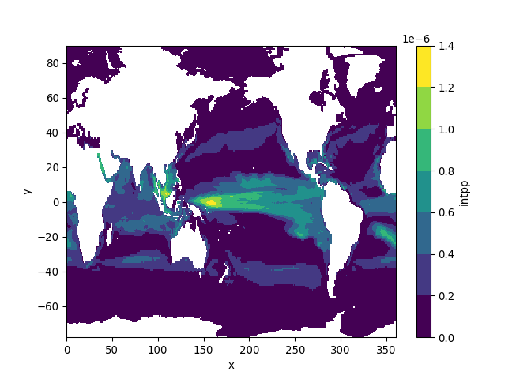

Accessing and downloading CMIP6 data
================
Denisse Fierro Arcos
2022-10-28

-   <a href="#accessing-and-downloading-subsets-of-cmip6-data"
    id="toc-accessing-and-downloading-subsets-of-cmip6-data">Accessing and
    downloading subsets of CMIP6 data</a>
    -   <a href="#switching-to-python" id="toc-switching-to-python">Switching to
        <code>Python</code></a>
    -   <a href="#loading-python-libraries"
        id="toc-loading-python-libraries">Loading <code>Python</code>
        libraries</a>
    -   <a href="#transforming-cmip6-search-results-into-a-python-variable"
        id="toc-transforming-cmip6-search-results-into-a-python-variable">Transforming
        CMIP6 search results into a <code>Python</code> variable</a>
    -   <a href="#accessing-and-saving-cmip6-data"
        id="toc-accessing-and-saving-cmip6-data">Accessing and saving CMIP6
        data</a>
    -   <a href="#checking-subsetted-data"
        id="toc-checking-subsetted-data">Checking subsetted data</a>
    -   <a href="#plotting-results" id="toc-plotting-results">Plotting
        results</a>

## Accessing and downloading subsets of CMIP6 data

We will now switch to `Python` to make use of the `xmip` library that
allow us to standardise variable names for CMIP6 data.

### Switching to `Python`

The `reticulate` package in `R` allow us to use `Python` within an `R`
script. We will be using a `conda environment` which in simple terms is
a directory that contains all the `Pyhton` libraries and the
dependencies needed to run this script. The `README` file in this
repository has instructions on how to create this environment.

``` r
#Activating the conda environment containing relevant Python libraries
use_condaenv("CMIP6_data")
```

### Loading `Python` libraries

``` python
#Easy access to data hosted online
import requests

#Loading and manipulating netcdf files
from netCDF4 import Dataset
import xarray as xr
import numpy as np
import pandas as pd

#Standardisation of CMIP6 data for easy data post-processing
from xmip.preprocessing import rename_cmip6, replace_x_y_nominal_lat_lon, promote_empty_dims, broadcast_lonlat

#Dealing with file paths
import os
from glob import glob

#Plotting
import matplotlib
matplotlib.use('Agg')
```

### Transforming CMIP6 search results into a `Python` variable

In this step we can use either of the search results. In the example
below, we will be working with the merged search results.

``` python
CMIP6_query = pd.read_csv("../Outputs/results_merged.csv")

CMIP6_query = CMIP6_query.astype({'decade_0_start': 'int32', 'decade_0_end': 'int32',\
'decade_N_start': 'int32', 'decade_N_end': 'int32'})

CMIP6_query.head(n = 2)
```

    ##                                              file_id  ...  keep
    ## 0  CMIP6.CMIP.CSIRO.ACCESS-ESM1-5.historical.r1i1...  ...  True
    ## 1  CMIP6.CMIP.CSIRO.ACCESS-ESM1-5.historical.r1i1...  ...  True
    ## 
    ## [2 rows x 33 columns]

### Accessing and saving CMIP6 data

We will now load the CMIP6 data into a temporary file in memory, so we
can subset it, standardise its variables names and save a local copy. We
will loop through each item in the search results.

``` python
def download_CMIP6(df):
  #Getting key information to load CMIP6 data locally from query results
  #URL address (include "#mode=bytes" at the end of the URL if not working)
  url = df['file_url']
  #Variable name
  var_id = df['variable_id'][0]
  #Start decades
  dec_0 = int(df['decade_0_start'][0])
  dec_N = int(df['decade_N_start'][0])
  #File paths
  out_folder = df['out_full_folder'][0]
  #Ensuring folder exists
  os.makedirs(out_folder, exist_ok = True)
  #File name with full path
  out_file = df['out_path'][0]
  
  ds = []
  for ind in df.index:
    #Loading data to memory in a temporary file
    link = requests.get(url[ind]).content
    remote = Dataset(var_id, memory = link)
    #Loading as xarray dataset
    sub = xr.open_dataset(xr.backends.NetCDF4DataStore(remote))
    ds.append(sub)
  ds = xr.concat(ds, dim = 'time')
    
  #Standardising CMIP6 data
  ds = rename_cmip6(ds)
  ds = promote_empty_dims(ds)
  ds = broadcast_lonlat(ds)
  ds = replace_x_y_nominal_lat_lon(ds)
  
  #Subsetting data - First and last decade and stitching them together
  d0 = ds.sel(time = slice(str(dec_0), str(dec_0+9)))
  dN = ds.sel(time = slice(str(dec_N), str(dec_N+9)))
  
  #Combining first and last decade into one dataset
  ds_sub = xr.concat([d0, dN], dim = 'time')
  
  #Saving subsetted dataset
  ds_sub.to_netcdf(out_file)
```

``` python
#Starting loop
for mod in np.unique(CMIP6_query['source_id']):
  mod_id = CMIP6_query[CMIP6_query['source_id'] == mod].reset_index()
  download_CMIP6(mod_id)
```

### Checking subsetted data

We can load one of the datasets we saved in the previous step to check
its contents.

``` python
#Loading last dataset saved locally
ds = xr.open_dataset(CMIP6_query['out_path'][0])
#Checking contents
ds
```

    ## <xarray.Dataset>
    ## Dimensions:      (time: 240, bnds: 2, y: 300, x: 360, vertex: 4)
    ## Coordinates:
    ##   * time         (time) datetime64[ns] 1850-01-16T12:00:00 ... 2014-12-16T12:...
    ##   * y            (y) float64 -77.88 -77.63 -77.38 -77.13 ... 88.87 89.31 89.75
    ##   * x            (x) float64 0.5 1.5 2.5 3.5 4.5 ... 356.5 357.5 358.5 359.5
    ##   * bnds         (bnds) int64 0 1
    ##   * vertex       (vertex) int64 0 1 2 3
    ## Data variables:
    ##     time_bounds  (time, bnds) datetime64[ns] ...
    ##     lat          (time, y, x) float64 ...
    ##     lon          (time, y, x) float64 ...
    ##     lat_bounds   (time, y, x, vertex) float64 ...
    ##     lon_bounds   (time, y, x, vertex) float64 ...
    ##     intpp        (time, y, x) float32 ...
    ## Attributes: (12/47)
    ##     Conventions:            CF-1.7 CMIP-6.2
    ##     activity_id:            CMIP
    ##     branch_method:          standard
    ##     branch_time_in_child:   0.0
    ##     branch_time_in_parent:  21915.0
    ##     creation_date:          2019-11-15T16:14:52Z
    ##     ...                     ...
    ##     variable_id:            intpp
    ##     variant_label:          r1i1p1f1
    ##     version:                v20191115
    ##     cmor_version:           3.4.0
    ##     tracking_id:            hdl:21.14100/44046366-ac50-4be5-bf42-e1be7c65e37e
    ##     license:                CMIP6 model data produced by CSIRO is licensed un...

### Plotting results

Finally, we can calculate monthly means over the first decade of
interest and plot these results.

``` python
#Selecting the first decade
ds = ds.sel(time = str(CMIP6_query['decade_0_start'][0]))
#Calculating monthly means and plotting only the first month
ds[CMIP6_query['variable_id'][0]].mean('time').plot(levels = 9)
#Show plot
matplotlib.pyplot.show()
#Close plot if needed
# matplotlib.pyplot.close()
```

<!-- -->

In this notebook, we have successfully downloading a subset of the CMIP6
datasets that we identified in [the first
notebook](01_Querying_CMIP6_database.md). Next, we will describe how to
calculate monthly means from the datasets that we saved locally.
