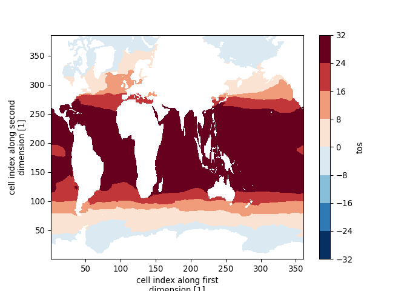

Accessing and downloading CMIP6 data
================
Denisse Fierro Arcos
2022-10-28

-   <a href="#introduction" id="toc-introduction">Introduction</a>
    -   <a href="#accessing-and-downloading-cmip6-data"
        id="toc-accessing-and-downloading-cmip6-data">Accessing and downloading
        CMIP6 data</a>
-   <a href="#switching-to-python" id="toc-switching-to-python">Switching to
    <code>Python</code></a>
    -   <a href="#loading-python-libraries"
        id="toc-loading-python-libraries">Loading <code>Python</code>
        libraries</a>
        -   <a href="#transforming-cmip6-search-results-into-a-python-variable"
            id="toc-transforming-cmip6-search-results-into-a-python-variable">Transforming
            CMIP6 search results into a <code>Python</code> variable</a>
        -   <a href="#loading-cmip6-data-saved-locally"
            id="toc-loading-cmip6-data-saved-locally">Loading CMIP6 data saved
            locally</a>
        -   <a href="#checking-subsetted-data"
            id="toc-checking-subsetted-data">Checking subsetted data</a>
        -   <a href="#plotting-results" id="toc-plotting-results">Plotting
            results</a>

# Introduction

Based on the results query obtained from our [previous
notebook](01_Querying_CMIP6_database.md), we will download the raw CMIP6
files using `R`. Then, we will switch to `Python` to make use of the
`xmip` library that allow us to standardise variable names for CMIP6
data.

## Accessing and downloading CMIP6 data

First, we will load the `R` libraries we will need for this notebook.

``` r
library(tidyverse)
```

    ## ── Attaching packages ─────────────────────────────────────── tidyverse 1.3.2 ──
    ## ✔ ggplot2 3.3.6.9000     ✔ purrr   0.3.4     
    ## ✔ tibble  3.1.8          ✔ dplyr   1.0.10    
    ## ✔ tidyr   1.2.0          ✔ stringr 1.4.1     
    ## ✔ readr   2.1.2          ✔ forcats 0.5.1     
    ## ── Conflicts ────────────────────────────────────────── tidyverse_conflicts() ──
    ## ✖ dplyr::filter() masks stats::filter()
    ## ✖ dplyr::lag()    masks stats::lag()

We will now load the query results we obtained from the previous
notebook. Remember that we added a number of columns that could help us
select a subset of files that are relevant to us. For example, if we
want only files that linked to the first decade of the dataset, we could
use the `decade` column, where `dec0` means that a particular file
contains data for the first decade, and `both` means that the file has
the first and last decades.

``` r
#Loading the results
results_query <- read_csv("../Outputs/results_query_tos_siconc.csv")
```

    ## Rows: 371 Columns: 34
    ## ── Column specification ────────────────────────────────────────────────────────
    ## Delimiter: ","
    ## chr  (24): file_id, dataset_id, mip_era, activity_drs, institution_id, sourc...
    ## dbl   (7): version, file_size, count, decade_0_start, decade_0_end, decade_N...
    ## lgl   (1): keep
    ## dttm  (2): datetime_start, datetime_end
    ## 
    ## ℹ Use `spec()` to retrieve the full column specification for this data.
    ## ℹ Specify the column types or set `show_col_types = FALSE` to quiet this message.

We will now download all files into our disk. We will put them in a
temporary folder, which we will remove after we have process all files.

``` r
for(i in 1:nrow(results_query)){
  #Creating the temporary folder where raw files will be saved
  path_out <- file.path(results_query$out_full_folder[i], "raw")
  #Using their original file name
  fn <- str_extract(results_query$file_id[i], ".*[0-9].nc")
  #If temporary file does not exist, create it
  if(file.exists(path_out) == F){
    dir.create(path_out, recursive = T)
  }
  #Downloading file and saving into temporary folder
  curl::curl_download(results_query$file_url[i], file.path(path_out, fn))
  }
```

# Switching to `Python`

The `reticulate` package in `R` allow us to use `Python` within an `R`
script. We will be using the `CMIP6_data` conda environment, which in
simple terms is a directory that contains all the `Pyhton` libraries and
the dependencies needed to run this script. The `README` file in this
repository has instructions on how to create this environment using the
`yml` file provided in this repository.

``` r
#Activating the conda environment containing relevant Python libraries
reticulate::use_condaenv("CMIP6_data")
```

## Loading `Python` libraries

``` python
#Loading and manipulating netcdf files
import xarray as xr
import numpy as np
import pandas as pd

#Standardisation of CMIP6 data for easy data post-processing
from xmip.preprocessing import rename_cmip6, promote_empty_dims, broadcast_lonlat, correct_coordinates

#Dealing with file paths
import os
from glob import glob
import re

#Plotting
import matplotlib.pyplot as plt
```

### Transforming CMIP6 search results into a `Python` variable

In this step we can use either of the search results. In the example
below, we will be working with the merged search results.

``` python
#Transfer search results from R into Python
CMIP6_query = r.results_query

#Load data and ensure there are no duplicates
CMIP6_query = CMIP6_query.drop_duplicates()

#Ensure decades are integer numbers
CMIP6_query = CMIP6_query.astype({'decade_0_start': 'int32', 'decade_0_end': 'int32',\
'decade_N_start': 'int32', 'decade_N_end': 'int32'})

CMIP6_query.head(n = 2)
```

    ##                                              file_id  ...                                           out_path
    ## 0  CMIP6.CMIP.CSIRO.ACCESS-ESM1-5.historical.r1i1...  ...  /perm_storage/home/data/CMIP6_data/ACCESS-ESM1...
    ## 1  CMIP6.CMIP.CSIRO.ACCESS-ESM1-5.historical.r1i1...  ...  /perm_storage/home/data/CMIP6_data/ACCESS-ESM1...
    ## 
    ## [2 rows x 34 columns]

### Loading CMIP6 data saved locally

We will load the CMIP6 data that we downloaded earlier. We will use the
`xmip` library to standardise outputs, extract only the times of
interest and save these locally.

First, we will define a function that will standardise all variable
names in CMIP6 model outputs before saving a copy locally.

``` python
#Defining function to standardise CMIP6 data
def standard(dataset):
  #Renaming all variables so they are the same for all models
  dataset = rename_cmip6(dataset)
  #Adding an index if not included
  dataset = promote_empty_dims(dataset)
  #Converting coordinates from 1D to 2D arrays
  dataset = broadcast_lonlat(dataset)
  #Correcting coordinates if needed so they appear in format 0-360 degrees
  dataset = correct_coordinates(dataset)
  return dataset
```

Now we will get a list of all raw files saved into our disk. We will use
this list to load each dataset and apply the standardisation of
variables.

``` python
#Base folder containing all our data
out_folder = "/perm_storage/home/data/CMIP6_data"

#Searching all netcdf files within 'raw' folders for each model/experiment
raw_file_list = glob(os.path.join(out_folder, '*/*/raw/*.nc'))

#Getting a list of paths where we will save the standardise datasets. 
#We will simply remove the 'raw' folder
std_file_list = [re.sub("/raw/", "/", f) for f in raw_file_list]
```

We will now apply the standardisation to each file individually.

``` python
#Load each dataset individually
for i, f in enumerate(raw_file_list):
  ds = xr.open_dataset(f)
  #Standardise variables
  ds = standard(ds)
  #Saving standardised dataset
  ds.to_netcdf(std_file_list[i])

#Checking the amount of standardised files on disk matches number of raw files
std_file_list = glob(os.path.join(out_folder, '*/*/*.nc'))
len(std_file_list) == len(raw_file_list)

#Deleting variables no longer needed
del ds, f, i
```

We can now remove the raw files to free up disk space.

``` python
#Delete raw datasets
[os.remove(f) for f in raw_file_list]

#Deleting raw folders
[os.rmdir(d) for d in glob(os.path.join(out_folder, '*/*/r*'))]
```

Now we can create single files for each decade/model/variable of
interest.

``` python
def subsetting_data(df, var_id):
  #Start year for decade 0 and decade N
  dec_0 = int(np.unique(df['decade_0_start']))
  dec_N = int(np.unique(df['decade_N_start']))
  #Input folder paths
  out_folder = np.unique(df['out_full_folder']).tolist()
  if len(df) == 1:
    file_names = [re.split('\\||_[0-9]\\|', df['file_id'].squeeze())[0]]
  else:
    file_names = df['file_id'].squeeze().apply(lambda x: re.split('\\||_[0-9]\\|', x)[0])
    file_names = sorted(file_names)
  #Output file name with full path
  out_path = sorted(np.unique(df['out_path']).tolist())
  
  #Loading data - single file 
  if len(df) == 1:
    fn_full = os.path.join(out_folder[0], file_names[0])
    ds = xr.open_dataset(fn_full)
  else:
    ds = []
    for fp in file_names:
      fn_full = os.path.join(out_folder[0], fp)
      ds_sub = xr.open_dataset(fn_full)[var_id].to_dataset()
      ds.append(ds_sub)
    ds = xr.concat(ds, dim = 'time')
  
  #Subsetting data - First and last decade and stitching them together
  d0 = ds.sel(time = slice(str(dec_0), str(dec_0+9)))
  dN = ds.sel(time = slice(str(dec_N), str(dec_N+9)))
  
  #Saving outputs
  if len(out_path) == 1:
    #Combining first and last decade into one dataset
    ds_sub = xr.concat([d0, dN], dim = 'time')
    #Saving subsetted dataset
    ds_sub.to_netcdf(out_path[0])
  else:
    out_d0 = [i for i in out_path if str(dec_0) in i]
    d0.to_netcdf(out_d0[0])
    out_dN = [i for i in out_path if str(dec_N) in i]
    dN.to_netcdf(out_dN[0])
```

``` python
for names, sub in CMIP6_query.groupby(['source_id', 'experiment_id', 'grid_label', 'variable_id']):
  subsetting_data(sub.reset_index(drop = True), names[-1])
```

### Checking subsetted data

We can load one of the datasets we saved in the previous step to check
its contents.

``` python
#Loading last dataset saved locally
ds = xr.open_dataset(CMIP6_query['out_path'][110])
#Checking contents
ds
```

    ## <xarray.Dataset>
    ## Dimensions:  (time: 240, y: 385, x: 360)
    ## Coordinates:
    ##   * time     (time) object 1850-01-16 12:00:00 ... 2014-12-16 12:00:00
    ##   * y        (y) int32 1 2 3 4 5 6 7 8 9 ... 377 378 379 380 381 382 383 384 385
    ##   * x        (x) int32 1 2 3 4 5 6 7 8 9 ... 352 353 354 355 356 357 358 359 360
    ##     lat      (y, x) float64 ...
    ##     lon      (y, x) float64 ...
    ## Data variables:
    ##     tos      (time, y, x) float32 ...

### Plotting results

Finally, we can calculate monthly means over the first decade of
interest and plot these results.

``` python
#Selecting the first decade
ds = ds.sel(time = str(CMIP6_query['decade_0_start'][110]))
#Calculating monthly means and plotting only the first month
ds[CMIP6_query['variable_id'][110]].mean('time').plot(levels = 9)
#Show plot
plt.show()
#Close plot if needed
# plt.close()
```

<!-- -->

In this notebook, we have successfully downloading a subset of the CMIP6
datasets that we identified in [the first
notebook](01_Querying_CMIP6_database.md). Next, we will describe how to
calculate monthly means from the datasets that we saved locally.
