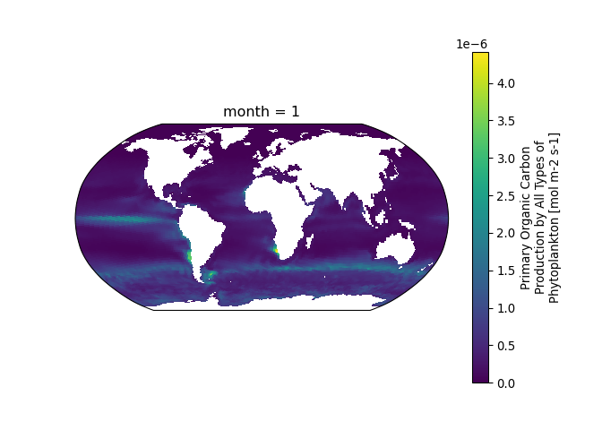

Calculating monthly means in Python using CMIP6 ESM data
================
Denisse Fierro Arcos
2022-10-25

-   <a href="#introduction" id="toc-introduction">Introduction</a>
    -   <a href="#loading-relevant-python-libraries"
        id="toc-loading-relevant-python-libraries">Loading relevant Python
        libraries</a>
    -   <a href="#loading-search-results-from-first-notebook"
        id="toc-loading-search-results-from-first-notebook">Loading search
        results from <span>first notebook</span></a>
    -   <a href="#calculating-monthly-means-per-decade"
        id="toc-calculating-monthly-means-per-decade">Calculating monthly means
        per decade</a>
    -   <a href="#checking-results" id="toc-checking-results">Checking
        results</a>

# Introduction

In this notebook, we will use the `xarray` library in `Python` to
calculate monthly means using the CMIP6 data downloaded in the previous
step: [02_Downloading_CMIP6_data](02_Downloading_CMIP6_data.md). We will
then save the results as a netcdf files locally.

``` r
library(reticulate)
use_condaenv("CMIP6_data")
```

## Loading relevant Python libraries

``` python
import xarray as xr
import os
from glob import glob
import pandas as pd
import matplotlib.pyplot as mpl
```

## Loading search results from [first notebook](01_Querying_CMIP6_database.md)

In the first notebook, we added a new column that points to the location
where the CMIP6 data we are interested in where saved. We will load them
to our environment before we calculate the monthly means for each
variable.

Recall from the previous step, some models had multiple files available
for the `intpp` variable. We will remove any duplicate entries as we
saved a single file with the initial and last decade per model.

``` python
CMIP6_query = pd.read_csv("../Outputs/results_merged.csv")

CMIP6_query = CMIP6_query.astype({'decade_0_start': 'int32', 'decade_0_end': 'int32',\
'decade_N_start': 'int32', 'decade_N_end': 'int32'})

CMIP6_query = CMIP6_query.drop_duplicates(subset = ['out_file_name']).reset_index()

CMIP6_query.head(n = 2)
```

    ##    index  ...  keep
    ## 0      0  ...  True
    ## 1      1  ...  True
    ## 
    ## [2 rows x 34 columns]

## Calculating monthly means per decade

After monthly means are calculated, one netcdf file per decade will be
saved locally.

``` python
def month_mean_CMIP6(df):
  #Loading dataset
  ds = xr.open_dataset(df['out_path'])
  #Getting start of decades of interest
  dec0 = df['decade_0_start']
  decN = df['decade_N_start']
  #Getting name of variable
  var_id = df['variable_id']
  #Getting folder path where means will be saved
  out_folder = df['out_full_folder']
  base_name = df['base_file_name']
  out_dec0 = os.path.join(out_folder, f'{base_name}.MonthlyMean.{str(dec0)}-{str(dec0+9)}.nc')
  out_decN = os.path.join(out_folder, f'{base_name}.MonthlyMean.{str(decN)}-{str(decN+9)}.nc')
  
  #Calculating monthly means per decade
  #First decade
  ds0 = ds[var_id].sel(time = slice(str(dec0), str(dec0+9))).groupby('time.month').mean('time')
  #Last decade
  dsN = ds[var_id].sel(time = slice(str(decN), str(decN+9))).groupby('time.month').mean('time')
  
  #Saving outputs as netcdf files
  ds0.to_netcdf(out_dec0)
  dsN.to_netcdf(out_decN)
```

Applying function above for each file saved locally.

``` python
#Starting loop to calculate and save monthly means
for i in CMIP6_query.index:
  ds_data = CMIP6_query.iloc[i]
  month_mean_CMIP6(ds_data)
```

## Checking results

We will load randomly select a file from our disk, and plot all months
to check monthly means.

``` python
#Selecting one file at random
file_path = glob(os.path.join(CMIP6_query['out_full_folder'][5], "*.MonthlyMean*.nc"))[0]

#Loading last dataset saved
test = xr.open_dataset(file_path)
#Getting name of variable in dataset
varname = list(test.keys())[0]

#Plotting all months in dataset
test[varname].plot(col = 'month', col_wrap = 3)
```

    ## <xarray.plot.facetgrid.FacetGrid object at 0x7f51ce814ee0>

``` python
mpl.show()
```

<!-- -->

We have now calculated monthly means and saved outputs as netcdf files.
In the next notebook, we will be looking at plotting these files in `R`.
