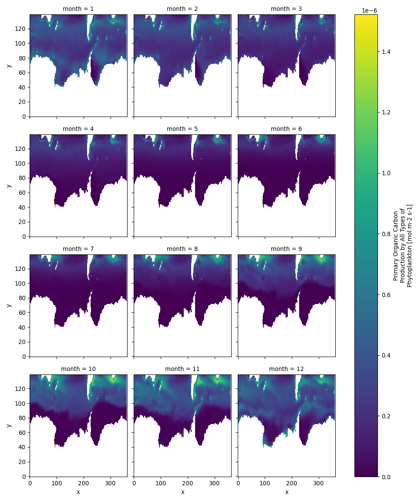
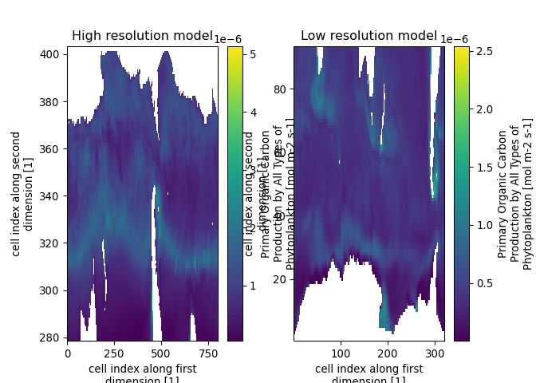
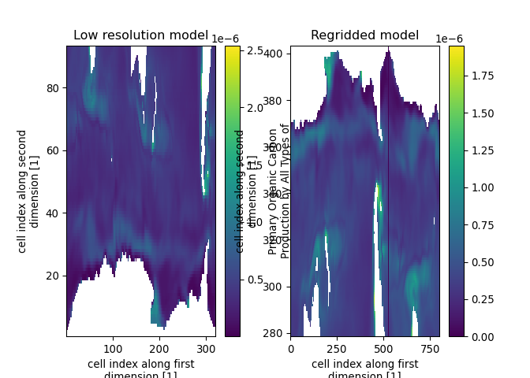
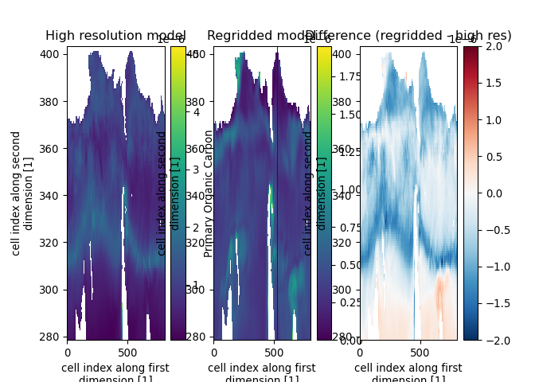
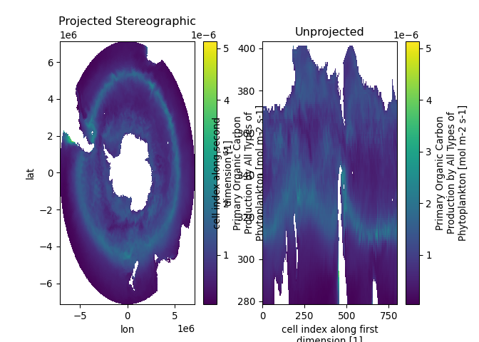
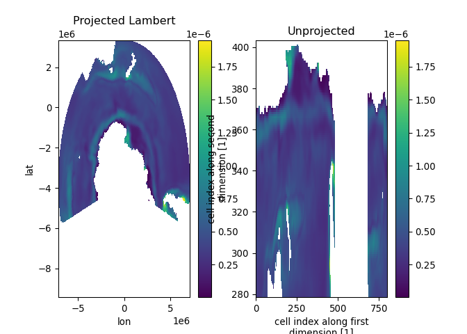

Subsetting mean data
================
Denisse Fierro Arcos
2023-01-25

-   <a href="#introduction" id="toc-introduction">Introduction</a>
-   <a href="#loading-python" id="toc-loading-python">Loading Python</a>
    -   <a href="#loading-relevant-python-libraries"
        id="toc-loading-relevant-python-libraries">Loading relevant Python
        libraries</a>
    -   <a href="#loading-results-of-cmip6-database-query"
        id="toc-loading-results-of-cmip6-database-query">Loading results of
        CMIP6 database query</a>
    -   <a href="#subsetting-data" id="toc-subsetting-data">Subsetting data</a>
    -   <a href="#checking-results-of-subsetted-data"
        id="toc-checking-results-of-subsetted-data">Checking results of
        subsetted data</a>
    -   <a href="#regridding-data" id="toc-regridding-data">Regridding data</a>
    -   <a href="#reprojecting" id="toc-reprojecting">Reprojecting</a>

# Introduction

In this notebook, we will extract data for the Southern Ocean and regrid
all model outputs so they match the highest resolution dataset
available.

``` r
library(tidyverse)
```

Checking highest resolution available

``` r
results_query <- read_csv("../Outputs/results_query_tos_siconc.csv")
```

    ## Rows: 371 Columns: 34
    ## ── Column specification ────────────────────────────────────────────────────────
    ## Delimiter: ","
    ## chr  (24): file_id, dataset_id, mip_era, activity_drs, institution_id, sourc...
    ## dbl   (7): version, file_size, count, decade_0_start, decade_0_end, decade_N...
    ## lgl   (1): keep
    ## dttm  (2): datetime_start, datetime_end
    ## 
    ## ℹ Use `spec()` to retrieve the full column specification for this data.
    ## ℹ Specify the column types or set `show_col_types = FALSE` to quiet this message.

``` r
results_query %>% 
  group_by(source_id, nominal_resolution) %>% 
  count()
```

    ## # A tibble: 10 × 3
    ## # Groups:   source_id, nominal_resolution [10]
    ##    source_id     nominal_resolution     n
    ##    <chr>         <chr>              <int>
    ##  1 ACCESS-ESM1-5 250 km                 9
    ##  2 CMCC-ESM2     100 km                 9
    ##  3 EC-Earth3-CC  100 km               180
    ##  4 GFDL-CM4      1x1 degree            19
    ##  5 GFDL-ESM4     1x1 degree            22
    ##  6 IPSL-CM6A-LR  100 km                 9
    ##  7 MPI-ESM1-2-HR 50 km                 42
    ##  8 MPI-ESM1-2-LR 250 km                27
    ##  9 NorESM2-LM    100 km                27
    ## 10 NorESM2-MM    100 km                27

The highest resolution available is `MPI-ESM1-2-HR` with a nominal
horizontal resolution of 50 km. Before performing calculations across
different models with different grids, we will regrid all models to the
grid used by `MPI-ESM1-2-HR` using the
[`xESMF`](https://xesmf.readthedocs.io/en/latest/) package for `Python`.
To interpolate the data during the regridding process, we will use a
`bilinear` method. But it is worth noting that there are multiple
algorithms available to interpolate data, and the most appropriate
choice of algorithm will depend on the data you are dealing with and the
type of grid. For more information on interpolation algorithms, see
[here](https://xesmf.readthedocs.io/en/latest/notebooks/Compare_algorithms.html),
[here](https://desktop.arcgis.com/en/arcmap/latest/tools/3d-analyst-toolbox/comparing-interpolation-methods.htm)
and
[here](https://climatedataguide.ucar.edu/climate-tools/regridding-overview).

We will now switch to `Python` to continue with our analysis.

# Loading Python

``` r
reticulate::use_condaenv("CMIP6_data")
```

## Loading relevant Python libraries

``` python
import xarray as xr
from glob import glob
import numpy as np
import re
import matplotlib.pyplot as plt
import cartopy
import cartopy.crs as ccrs
from pyproj.transformer import Transformer, AreaOfInterest
from pyproj import CRS, transform, Proj
import xesmf as xe
```

## Loading results of CMIP6 database query

We will get a list of the Monthly Mean files we calculated in [step
3](03b_Calculating_monthly_means_in_Python.md). We will do this with the
`glob` library.

``` python
#Note that we provide the main folder path and include asterisks (*) for the folders that change name (models and experiments)
file_paths = [i for i in glob("/perm_storage/home/data/CMIP6_data/*/*/*MonthlyMean*") if 'SO-E'not in i]
```

## Subsetting data

In this example, we will select data for the Southern Ocean. We have
defined this area to be all waters south of
30S.

First, we will define a function to subset our data. Our function needs
the following inputs: - `path` (string) - it contains the file path to
the dataset to be processed - `ymin` and `ymax` (numeric) - the
represent the latitudinal limits for the area of interest - `file_sufix`
(string) - text that will added to the end of the file from which data
is subsetted. It allows to easily identify subsetted data

``` python
def subset_data(path, ymin, ymax, file_sufix):
  #Loading dataset
  ds = xr.open_dataset(path)
  #Checking that x dimension refers to longitude. If not, rename dimensions x for longitude and y for latitude
  if len(ds.lon[0]) != len(ds.x):
    ds = ds.rename({'y':'lon_c', 'x': 'lat_c'}).rename({'lon_c': 'x', 'lat_c': 'y'})
  #Subsetting data using boundaries provided
  ds = ds.where((ds.lat >= ymin) & (ds.lat <= ymax), drop = True)
  #Rearrange columns by latitude
  ds = ds.sortby('y')
  #Filename to save subsetted data
  fn_out = re.split('\\.nc', path)[0]
  fn_out = f'{fn_out}_{file_sufix}.nc'
  #Saving subsetted dataset
  ds.to_netcdf(fn_out)
  ds.close()
```

We will now apply the above function to each Monthly Mean file.

``` python
for f in file_paths:
  subset_data(f, -90, -30, 'SouthernOcean')
```

## Checking results of subsetted data

We will first check that the number of files produced (i.e., files
containing suffix `SouthernOcean`) and the files used as input are the
same.

``` python
#Getting list of all subsetted files
paths_SO = glob("/perm_storage/home/data/CMIP6_data/*/*/*SouthernOcean*")

#Ensuring we have the same amount of input and output files
len(file_paths) == len(paths_SO)
```

    ## False

Since the number of input and output files match, we will plot one of
the subsetted files. We selected this file at random.

``` python
#Generating random number and loading data as data array
ind = np.random.default_rng(12345).integers(low = 0, high = len(paths_SO), size = 1)[0]
ds = xr.open_dataarray(paths_SO[ind])

#Plotting all months in data array
plt.close()
ds.plot(col = 'month', col_wrap = 3)
```

    ## <xarray.plot.facetgrid.FacetGrid object at 0x7f9347a84fa0>

``` python
plt.show()
```

<!-- -->

## Regridding data

Finally, we will regrid the subsetted data so it matches the highest
resolution grid available. From the first section of this notebook, we
can see that the highest resolution grid has a nominal horizontal
resolution of 50 km and it is used by the `MPI-ESM1-2-HR` model. For
this example, we will use primary productivity data (i.e., `intpp`) from
the `historical` experiments.

As a reminder, will use the
[`xESMF`](https://xesmf.readthedocs.io/en/latest/) library to regrid our
data, and we will use a `bilinear` algorithm.

``` python
#Getting paths for historical experiments for the high and one low resolution model
hist_intpp = [i for i in paths_SO if re.match('.*historical.*intpp.*', i)]
high_res = [i for i in hist_intpp if 'MPI-ESM1-2-HR' in i][0]
low_res = [i for i in hist_intpp if 'MPI-ESM1-2-HR' not in i][0]

#Loading data
ds_hr = xr.open_dataarray(high_res)
ds_lr = xr.open_dataarray(low_res)
```

We can check what the data currently looks like.

``` python
#Clearing previuous plots
plt.close()
#Creating a figure
fig = plt.figure()
#Adding subplot with high resolution model
ax1 = fig.add_subplot(121)
#Plotting first month only
ds_hr[0].plot(ax = ax1)
#Adding title
ax1.set_title('High resolution model')

#Adding subplot with low resolution model
ax2 = fig.add_subplot(122)
#Plotting first month only
ds_lr[0].plot(ax = ax2)
#Adding title
ax2.set_title('Low resolution model')

#Showing final figure
plt.show()
```

<!-- -->
We will regrid data using both datasets loaded with the `xESMF` package.

``` python
#Calculating regridder using a bilinear algorithm
reg = xe.Regridder(ds_lr, ds_hr, 'bilinear')

#Applying regridder to low resolution data 
```

    ## /perm_storage/home/lidefi87/miniconda3/envs/CMIP6_data/lib/python3.10/site-packages/xarray/core/dataarray.py:857: FutureWarning: elementwise comparison failed; returning scalar instead, but in the future will perform elementwise comparison
    ##   return key in self.data

``` python
reg_ds2 = reg(ds_lr)
```

Plotting results of regridded data side by side.

``` python
#Clearing previuous plots
plt.close()
#Creating a figure
fig = plt.figure()
#Adding subplot with high resolution model
ax1 = fig.add_subplot(121)
#Plotting first month only
ds_lr[0].plot(ax = ax1)
#Adding title
ax1.set_title('Low resolution model')

#Adding subplot with low resolution model
ax2 = fig.add_subplot(122)
#Plotting first month only
reg_ds2[0].plot(ax = ax2)
#Adding title
ax2.set_title('Regridded model')

#Showing final figure
plt.show()
```

<!-- -->
Calculating difference between regridded data and high resolution data,
and plotting results.

``` python
#Calculating differences
dif = reg_ds2 - ds_hr

#Clearing previuous plots
plt.close()
#Creating a figure
fig = plt.figure()
#Adding subplot with high resolution model
ax1 = fig.add_subplot(131)
#Plotting first month only
ds_hr[0].plot(ax = ax1)
#Adding title
ax1.set_title('High resolution model');

#Adding subplot with low resolution model
ax2 = fig.add_subplot(132)
#Plotting first month only
reg_ds2[0].plot(ax = ax2)
#Adding title
ax2.set_title('Regridded model');

#Adding subplot with low resolution model
ax3 = fig.add_subplot(133)
#Plotting first month only
dif[0].plot(ax = ax3)
#Adding title
ax3.set_title('Difference (regridded - high res)');

#Showing final figure
plt.show()
```

<!-- -->

## Reprojecting

First, we need to ensure the longitude values go from -180 to +180
instead of 0 to 360 degrees as they currently appear in our datasets.

``` python
#Changing longitude in both datasets
ds_hr.coords['lon'] = (ds_hr.coords['lon'] + 180)%360 -180
reg_ds2.coords['lon'] = (reg_ds2.coords['lon'] + 180)%360 -180

#Checking min and max values
print(reg_ds2.lon.min().values, reg_ds2.lon.max().values); 
```

    ## -179.94611970603063 179.60388029396938

``` python
print(ds_hr.lon.min().values, ds_hr.lon.max().values)
```

    ## -179.94611970603063 179.60388029396938

We have updated the longitude correctly. Now we are ready to reproject
our datasets. Note that since both datasets share the same grid, we only
need to do the coordinate transformation only once. The coordinate
reference system for the original dataset is WGS84 (EPSG 4326) and we
want to reproject to South Pole Stereograhic (EPSG 3976).

Note that below, we will create a new variable with the first month of
data before assigning the projected coordinates. We do this to show how
the projected and unprojected datasets look. However, we can simply
update the coordinates of the original variable if we no longer need it.

``` python
#Transforming coordinates from WGS84 to South Pole Stereographic
lon_stereo, lat_stereo = transform(Proj(init = 'epsg:4326'), Proj(init = 'epsg:3976'), ds_hr.lon, ds_hr.lat)

#We will create a new variable and attach new coordinates
```

    ## /perm_storage/home/lidefi87/miniconda3/envs/CMIP6_data/lib/python3.10/site-packages/pyproj/crs/crs.py:141: FutureWarning: '+init=<authority>:<code>' syntax is deprecated. '<authority>:<code>' is the preferred initialization method. When making the change, be mindful of axis order changes: https://pyproj4.github.io/pyproj/stable/gotchas.html#axis-order-changes-in-proj-6
    ##   in_crs_string = _prepare_from_proj_string(in_crs_string)
    ## /perm_storage/home/lidefi87/miniconda3/envs/CMIP6_data/lib/python3.10/site-packages/pyproj/crs/crs.py:141: FutureWarning: '+init=<authority>:<code>' syntax is deprecated. '<authority>:<code>' is the preferred initialization method. When making the change, be mindful of axis order changes: https://pyproj4.github.io/pyproj/stable/gotchas.html#axis-order-changes-in-proj-6
    ##   in_crs_string = _prepare_from_proj_string(in_crs_string)
    ## <string>:1: DeprecationWarning: This function is deprecated. See: https://pyproj4.github.io/pyproj/stable/gotchas.html#upgrading-to-pyproj-2-from-pyproj-1

``` python
ds_hr_stereo = ds_hr[0]
ds_hr_stereo.coords['lon'] = (('y','x'), lon_stereo)
ds_hr_stereo.coords['lat'] = (('y','x'), lat_stereo)

#Comparing results
plt.close()
#Initialising figure
fig = plt.figure()
#Adding projected data
ax1 = fig.add_subplot(121)
ds_hr_stereo.plot.pcolormesh('lon', 'lat', ax = ax1)
ax1.set_title('Projected Stereographic');
#Adding unprojected data
ax2 = fig.add_subplot(122)
ds_hr[0].plot.pcolormesh(ax = ax2)
ax2.set_title('Unprojected');
plt.show()
```

<!-- -->

We can also use any user-defined projections. In this case, we will mask
our data to focus on the East Antarctic and then we will apply a Lambert
Conformal Conic Projection that will center in this region.

``` python
#Masking data to East Antarctica
reg_ds2_EA = reg_ds2.where((reg_ds2.lon <= -60) | (reg_ds2.lon >= 30))

#Transforming coordinates from WGS84 to user-defomed Lambert Conformal Conic
lon_lambert, lat_lambert = transform(Proj(init = 'epsg:4326'), 
Proj('+proj=lcc +lon_0=164 +lat_0=-61 +lat_1=-34 +lat_2=-69 +datum=WGS84 +ellps=WGS84 +towgs84=0,0,0'), 
reg_ds2_EA.lon, reg_ds2_EA.lat)

#We will create a new variable and attach new coordinates
```

    ## /perm_storage/home/lidefi87/miniconda3/envs/CMIP6_data/lib/python3.10/site-packages/pyproj/crs/crs.py:141: FutureWarning: '+init=<authority>:<code>' syntax is deprecated. '<authority>:<code>' is the preferred initialization method. When making the change, be mindful of axis order changes: https://pyproj4.github.io/pyproj/stable/gotchas.html#axis-order-changes-in-proj-6
    ##   in_crs_string = _prepare_from_proj_string(in_crs_string)
    ## <string>:1: DeprecationWarning: This function is deprecated. See: https://pyproj4.github.io/pyproj/stable/gotchas.html#upgrading-to-pyproj-2-from-pyproj-1

``` python
reg_ds2_lambert = reg_ds2_EA[0]
reg_ds2_lambert.coords['lat'] = (('y','x'), lat_lambert)
reg_ds2_lambert.coords['lon'] = (('y','x'), lon_lambert)

#Comparing results
plt.close()
#Initialising figure
fig = plt.figure()
#Adding projected data
ax1 = fig.add_subplot(121)
reg_ds2_lambert.plot.pcolormesh('lon', 'lat', ax = ax1)
ax1.set_title('Projected Lambert');
#Adding unprojected data
ax2 = fig.add_subplot(122)
reg_ds2_EA[0].plot.pcolormesh(ax = ax2)
ax2.set_title('Unprojected');
plt.show()
```

<!-- -->
